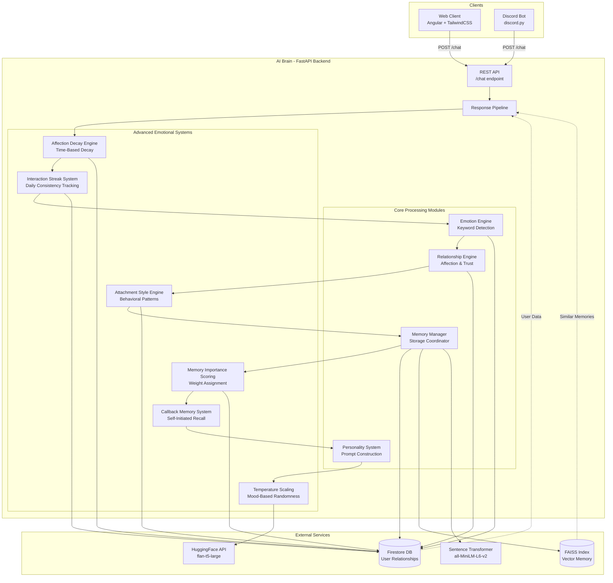
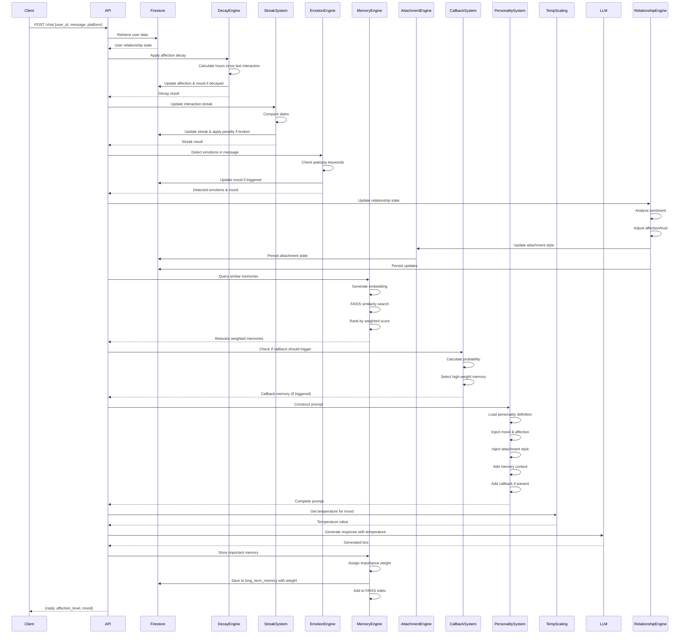

# Design Document: AI Waifu Cross-Platform System

## Overview

The AI Waifu Cross-Platform System is a conversational AI application featuring Mimi, a tsundere anime girl character with persistent memory and emotional intelligence. The system uses a centralized FastAPI backend (AI_Brain) that maintains consistent personality, memory, and relationship state across multiple client platforms (Angular web app and Discord bot).

### Core Design Principles

1. **Single Source of Truth**: All AI state resides in the centralized backend
2. **Platform Agnostic**: Clients are thin interfaces that delegate all AI logic to the backend
3. **Persistent Identity**: User relationships persist across sessions and platforms
4. **Contextual Awareness**: Vector similarity search enables semantic memory retrieval
5. **Emotional Intelligence**: Mood and affection systems create dynamic personality responses
6. **Modular Architecture**: Clear separation of concerns enables future extensions

### Technology Stack

- **Backend**: FastAPI (Python 3.10+)
- **Database**: Firebase Firestore (persistent storage)
- **Vector Store**: FAISS (semantic memory)
- **Embeddings**: sentence-transformers/all-MiniLM-L6-v2
- **LLM**: HuggingFace Inference API (google/flan-t5-large)
- **Web Client**: Angular 17+ with TailwindCSS
- **Discord Client**: discord.py

## Architecture

### System Architecture Diagram



### Request Flow Sequence



## Components and Interfaces

### 1. REST API Layer

**Module**: `main.py`

**Responsibilities**:
- Expose HTTP endpoints for client communication
- Validate incoming requests
- Orchestrate the response pipeline
- Handle errors and return appropriate responses

**Interface**:

```python
@app.post("/chat")
async def chat(request: ChatRequest) -> ChatResponse:
    """
    Process a chat message and return AI response.
    
    Args:
        request: ChatRequest containing user_id, message, platform
        
    Returns:
        ChatResponse with reply, affection_level, mood
        
    Raises:
        HTTPException: On validation or processing errors
    """
```

**Data Models**:

```python
class ChatRequest(BaseModel):
    user_id: str
    message: str
    platform: Literal["web", "discord"]

class ChatResponse(BaseModel):
    reply: str
    affection_level: int
    mood: str
```

### 2. Emotion Engine

**Module**: `emotion_engine.py`

**Responsibilities**:
- Detect emotional keywords in user messages
- Identify jealousy triggers
- Update mood state based on detected emotions
- Store emotional events in memory

**Interface**:

```python
class EmotionEngine:
    def __init__(self, firestore_client):
        self.firestore = firestore_client
        self.jealousy_keywords = [
            "she", "her", "another girl", "my girlfriend", 
            "my crush", "i like her", "she's cute",
            "talking to someone else", "other girl", "new girl"
        ]
        self.emotion_keywords = {
            "happy": ["happy", "excited", "great", "awesome", "love"],
            "sad": ["sad", "depressed", "down", "upset", "hurt"],
            "angry": ["angry", "mad", "furious", "annoyed"],
            "vulnerable": ["scared", "worried", "anxious", "nervous"]
        }
    
    def detect_emotions(self, message: str, user_id: str) -> EmotionResult:
        """
        Analyze message for emotional content and triggers.
        
        Args:
            message: User's message text
            user_id: User identifier
            
        Returns:
            EmotionResult with detected_mood, affection_delta, triggers
        """
    
    def check_jealousy(self, message: str) -> bool:
        """Check if message contains jealousy triggers."""
    
    def update_mood(self, user_id: str, mood: str, affection_delta: int):
        """Persist mood and affection changes to Firestore."""
```

### 3. Memory Engine

**Module**: `memory_engine.py`

**Responsibilities**:
- Generate embeddings for messages
- Store and retrieve vectors from FAISS
- Manage per-user FAISS indices
- Coordinate with Firestore for long-term memory

**Interface**:

```python
class MemoryEngine:
    def __init__(self, firestore_client):
        self.firestore = firestore_client
        self.model = SentenceTransformer('sentence-transformers/all-MiniLM-L6-v2')
        self.user_indices: Dict[str, faiss.Index] = {}
    
    def generate_embedding(self, text: str) -> np.ndarray:
        """Convert text to embedding vector."""
    
    def store_memory(self, user_id: str, message: str, is_important: bool):
        """
        Store message in vector database and optionally in Firestore.
        
        Args:
            user_id: User identifier
            message: Message text to store
            is_important: Whether to persist to long_term_memory
        """
    
    def retrieve_similar(self, user_id: str, query: str, k: int = 3) -> List[str]:
        """
        Retrieve k most similar past conversations.
        
        Args:
            user_id: User identifier
            query: Current message to find similar memories for
            k: Number of results to return
            
        Returns:
            List of similar past messages
        """
    
    def get_or_create_index(self, user_id: str) -> faiss.Index:
        """Get existing FAISS index or create new one for user."""
```

### 4. Personality System

**Module**: `personality_system.py`

**Responsibilities**:
- Load character definition from file
- Construct prompts with personality, mood, and context
- Adjust response tone based on affection level
- Maintain character consistency

**Interface**:

```python
class PersonalitySystem:
    def __init__(self, personality_file: str = "waifu_personality.txt"):
        self.personality_definition = self._load_personality(personality_file)
        self.affection_behaviors = self._define_affection_tiers()
        self.mood_modifiers = self._define_mood_modifiers()
    
    def construct_prompt(
        self,
        user_message: str,
        user_data: UserData,
        similar_memories: List[str],
        recent_context: List[Message]
    ) -> str:
        """
        Build complete prompt for LLM.
        
        Args:
            user_message: Current user input
            user_data: User relationship state from Firestore
            similar_memories: Relevant past conversations
            recent_context: Last 5 message exchanges
            
        Returns:
            Complete prompt string for LLM
        """
    
    def get_behavior_instructions(self, affection_level: int) -> str:
        """Get personality adjustments based on affection tier."""
    
    def get_mood_modifier(self, mood: str) -> str:
        """Get response tone adjustments based on current mood."""
```

### 5. Relationship Engine

**Module**: `relationship_engine.py`

**Responsibilities**:
- Analyze message sentiment
- Update affection and trust levels
- Determine relationship stage transitions
- Calculate mood changes

**Interface**:

```python
class RelationshipEngine:
    def __init__(self, firestore_client):
        self.firestore = firestore_client
        self.stage_thresholds = {
            "stranger": (0, 20),
            "friend": (21, 50),
            "close": (51, 80),
            "attached": (81, 100)
        }
    
    def update_relationship(
        self,
        user_id: str,
        message: str,
        current_state: UserData
    ) -> RelationshipUpdate:
        """
        Analyze message and update relationship metrics.
        
        Args:
            user_id: User identifier
            message: User's message
            current_state: Current relationship state
            
        Returns:
            RelationshipUpdate with new affection, trust, mood, stage
        """
    
    def analyze_sentiment(self, message: str) -> SentimentScore:
        """Determine if message is positive, negative, or neutral."""
    
    def calculate_affection_delta(self, sentiment: SentimentScore) -> int:
        """Calculate affection change based on sentiment."""
    
    def determine_stage(self, affection_level: int) -> str:
        """Map affection level to relationship stage."""
    
    def persist_update(self, user_id: str, update: RelationshipUpdate):
        """Save relationship changes to Firestore."""
```

### 6. LLM Service

**Module**: `llm_service.py`

**Responsibilities**:
- Interface with HuggingFace Inference API
- Handle API authentication
- Manage retries and timeouts
- Provide fallback responses

**Interface**:

```python
class LLMService:
    def __init__(self, api_token: str):
        self.api_token = api_token
        self.model = "google/flan-t5-large"
        self.api_url = f"https://api-inference.huggingface.co/models/{self.model}"
        self.fallback_responses = [
            "H-hey! Don't ignore me like that!",
            "Hmph, I'm not talking to you right now...",
            "W-what? I wasn't waiting for you or anything!"
        ]
    
    def generate_response(self, prompt: str, max_length: int = 150) -> str:
        """
        Generate text from LLM.
        
        Args:
            prompt: Complete prompt with personality and context
            max_length: Maximum response length
            
        Returns:
            Generated response text
            
        Raises:
            LLMServiceError: On API failures after retries
        """
    
    def get_fallback_response(self) -> str:
        """Return random fallback response for error cases."""
```

### 7. LLM Service

**Module**: `llm_service.py`

**Responsibilities**:
- Interface with HuggingFace Inference API
- Handle API authentication
- Manage retries and timeouts
- Provide fallback responses
- Accept temperature parameter for response randomness

**Interface**:

```python
class LLMService:
    def __init__(self, api_token: str):
        self.api_token = api_token
        self.model = "google/flan-t5-large"
        self.api_url = f"https://api-inference.huggingface.co/models/{self.model}"
        self.fallback_responses = [
            "H-hey! Don't ignore me like that!",
            "Hmph, I'm not talking to you right now...",
            "W-what? I wasn't waiting for you or anything!"
        ]
    
    def generate_response(self, prompt: str, max_length: int = 150, temperature: float = 0.5) -> str:
        """
        Generate text from LLM.
        
        Args:
            prompt: Complete prompt with personality and context
            max_length: Maximum response length
            temperature: Randomness control (0.0-1.0)
            
        Returns:
            Generated response text
            
        Raises:
            LLMServiceError: On API failures after retries
        """
    
    def get_fallback_response(self) -> str:
        """Return random fallback response for error cases."""
```

### 8. Affection Decay Engine

**Module**: `affection_decay_engine.py`

**Responsibilities**:
- Calculate time elapsed since last interaction
- Apply affection decay based on absence duration
- Update mood to "sad" for extended absences
- Ensure affection never drops below 0

**Interface**:

```python
class AffectionDecayEngine:
    def __init__(self, firestore_client):
        self.firestore = firestore_client
        self.decay_threshold_hours = 24
        self.sad_threshold_hours = 72
    
    def apply_decay(self, user_id: str, user_data: UserData) -> DecayResult:
        """
        Calculate and apply affection decay based on time since last interaction.
        
        Args:
            user_id: User identifier
            user_data: Current user relationship state
            
        Returns:
            DecayResult with hours_passed, affection_delta, new_mood
        """
    
    def calculate_hours_passed(self, last_interaction: datetime) -> int:
        """Calculate hours since last interaction."""
    
    def calculate_decay_amount(self, hours_passed: int) -> int:
        """Calculate affection points to decay (hours_passed // 24)."""
    
    def should_set_sad_mood(self, hours_passed: int) -> bool:
        """Check if absence exceeds sad threshold (72 hours)."""
    
    def persist_decay(self, user_id: str, new_affection: int, new_mood: str):
        """Update Firestore with decayed values."""
```

### 9. Memory Importance Scoring

**Module**: `memory_importance_scoring.py`

**Responsibilities**:
- Assign weight values (0.0-1.0) to memories
- Classify memory importance based on content
- Rank memories by weighted similarity
- Prioritize high-weight memories in retrieval

**Interface**:

```python
class MemoryImportanceScoring:
    def __init__(self):
        self.weight_categories = {
            "crisis": 1.0,
            "vulnerability": 0.9,
            "preference": 0.9,
            "emotional": 0.7,
            "factual": 0.5,
            "casual": 0.1
        }
    
    def assign_weight(self, message: str, emotion_result: EmotionResult) -> float:
        """
        Assign importance weight to a memory.
        
        Args:
            message: Message text to evaluate
            emotion_result: Detected emotions from Emotion Engine
            
        Returns:
            Weight value between 0.0 and 1.0
        """
    
    def classify_memory_type(self, message: str, emotion_result: EmotionResult) -> str:
        """Determine memory category (crisis, vulnerability, preference, etc.)."""
    
    def rank_by_weighted_similarity(
        self,
        memories: List[dict],
        similarity_scores: List[float]
    ) -> List[dict]:
        """
        Rank memories by product of similarity_score and weight.
        
        Args:
            memories: List of memory objects with text and weight
            similarity_scores: FAISS similarity scores
            
        Returns:
            Sorted list of memories by weighted score
        """
```

### 10. Attachment Style Engine

**Module**: `attachment_style_engine.py`

**Responsibilities**:
- Determine attachment style based on affection level
- Update attachment_state in Firestore
- Provide behavioral instructions for each style
- Intensify responses based on attachment state

**Interface**:

```python
class AttachmentStyleEngine:
    def __init__(self, firestore_client):
        self.firestore = firestore_client
        self.attachment_thresholds = {
            "avoidant": (0, 30),
            "anxious": (31, 59),
            "secure": (60, 79),
            "possessive": (80, 100)
        }
        self.attachment_behaviors = self._define_attachment_behaviors()
    
    def determine_attachment_state(self, affection_level: int) -> str:
        """
        Map affection level to attachment style.
        
        Args:
            affection_level: Current affection (0-100)
            
        Returns:
            Attachment state: avoidant, anxious, secure, or possessive
        """
    
    def get_attachment_instructions(self, attachment_state: str) -> str:
        """Get behavioral guidance for current attachment style."""
    
    def intensify_for_jealousy(self, attachment_state: str, base_response: str) -> str:
        """Amplify possessive behavior when jealousy is detected."""
    
    def update_attachment_state(self, user_id: str, new_state: str):
        """Persist attachment state to Firestore."""
```

### 11. Temperature Scaling System

**Module**: `temperature_scaling_system.py`

**Responsibilities**:
- Map mood states to LLM temperature values
- Provide temperature parameter for response generation
- Control response randomness based on emotional state

**Interface**:

```python
class TemperatureScalingSystem:
    def __init__(self):
        self.mood_temperature_map = {
            "angry": 0.3,      # Controlled, sharp
            "sad": 0.4,        # Subdued, quiet
            "neutral": 0.5,    # Standard variation
            "happy": 0.7,      # Playful variation
            "jealous": 0.8,    # Emotionally reactive
            "flustered": 0.9   # Chaotic, stuttering
        }
        self.default_temperature = 0.5
    
    def get_temperature(self, mood: str) -> float:
        """
        Get LLM temperature for current mood.
        
        Args:
            mood: Current emotional state
            
        Returns:
            Temperature value (0.0-1.0)
        """
    
    def log_temperature_usage(self, mood: str, temperature: float, user_id: str):
        """Log temperature selection for monitoring."""
```

### 12. Interaction Streak System

**Module**: `interaction_streak_system.py`

**Responsibilities**:
- Track consecutive days of user interaction
- Detect broken streaks
- Apply affection penalties for broken streaks
- Update mood when streaks are broken
- Persist streak data to Firestore

**Interface**:

```python
class InteractionStreakSystem:
    def __init__(self, firestore_client):
        self.firestore = firestore_client
        self.streak_break_penalty = 3
        self.streak_milestone_threshold = 7
    
    def update_streak(self, user_id: str, user_data: UserData) -> StreakResult:
        """
        Update interaction streak based on current date.
        
        Args:
            user_id: User identifier
            user_data: Current user relationship state
            
        Returns:
            StreakResult with new_streak, was_broken, affection_delta
        """
    
    def calculate_streak(self, last_chat_date: date, current_date: date, current_streak: int) -> tuple:
        """
        Determine new streak value and whether it was broken.
        
        Returns:
            (new_streak, was_broken)
        """
    
    def apply_streak_penalty(self, user_id: str, current_affection: int) -> int:
        """Decrease affection by penalty amount, ensuring it doesn't go below 0."""
    
    def should_mention_streak(self, streak_count: int) -> bool:
        """Check if streak is high enough to mention in prompt."""
    
    def persist_streak(self, user_id: str, new_streak: int, new_date: date):
        """Update Firestore with new streak data."""
```

### 13. Callback Memory System

**Module**: `callback_memory_system.py`

**Responsibilities**:
- Calculate probability of memory recall based on affection
- Select high-weight memories for callbacks
- Inject memory references into prompts
- Limit callback frequency to avoid repetition

**Interface**:

```python
class CallbackMemorySystem:
    def __init__(self):
        self.callback_phrases = [
            "Last time you said...",
            "I remember when you told me...",
            "You mentioned before that...",
            "Didn't you say...?",
            "I haven't forgotten that you..."
        ]
        self.min_affection_for_callbacks = 30
        self.high_weight_threshold = 0.7
        self.callback_limit_per_session = 1
    
    def should_trigger_callback(self, affection_level: int) -> bool:
        """
        Determine if memory callback should occur.
        
        Args:
            affection_level: Current affection (0-100)
            
        Returns:
            True if random value < (affection_level / 100)
        """
    
    def select_callback_memory(self, long_term_memory: List[dict]) -> Optional[dict]:
        """
        Select a high-weight memory for callback.
        
        Args:
            long_term_memory: List of memory objects with text and weight
            
        Returns:
            Selected memory or None if no suitable memories
        """
    
    def format_callback(self, memory: dict) -> str:
        """
        Format memory as a callback reference.
        
        Returns:
            Formatted string like "I remember when you told me {memory.text}"
        """
    
    def inject_callback(self, prompt: str, callback_text: str) -> str:
        """Insert callback reference into prompt context."""
    
    def log_callback_event(self, user_id: str, memory: dict, affection_level: int):
        """Log callback for monitoring."""
```

### 14. Response Pipeline

**Module**: `response_pipeline.py`

**Responsibilities**:
- Orchestrate all processing modules including advanced systems
- Manage execution order
- Handle module failures gracefully
- Coordinate state updates

**Interface**:

```python
class ResponsePipeline:
    def __init__(
        self,
        firestore_client,
        affection_decay_engine: AffectionDecayEngine,
        interaction_streak_system: InteractionStreakSystem,
        emotion_engine: EmotionEngine,
        memory_engine: MemoryEngine,
        memory_importance_scoring: MemoryImportanceScoring,
        personality_system: PersonalitySystem,
        relationship_engine: RelationshipEngine,
        attachment_style_engine: AttachmentStyleEngine,
        temperature_scaling_system: TemperatureScalingSystem,
        callback_memory_system: CallbackMemorySystem,
        llm_service: LLMService
    ):
        self.firestore = firestore_client
        self.affection_decay_engine = affection_decay_engine
        self.interaction_streak_system = interaction_streak_system
        self.emotion_engine = emotion_engine
        self.memory_engine = memory_engine
        self.memory_importance_scoring = memory_importance_scoring
        self.personality_system = personality_system
        self.relationship_engine = relationship_engine
        self.attachment_style_engine = attachment_style_engine
        self.temperature_scaling_system = temperature_scaling_system
        self.callback_memory_system = callback_memory_system
        self.llm_service = llm_service
        self.session_contexts: Dict[str, List[Message]] = {}
        self.session_callback_count: Dict[str, int] = {}
    
    async def process_message(
        self,
        user_id: str,
        message: str,
        platform: str
    ) -> ChatResponse:
        """
        Execute complete response generation pipeline with advanced systems.
        
        Pipeline steps:
        1. Retrieve user data from Firestore
        2. Apply affection decay based on time since last interaction
        3. Update interaction streak and apply penalties if broken
        4. Detect emotions and update mood
        5. Update relationship state and attachment style
        6. Query similar memories with importance weighting
        7. Determine if callback memory should be triggered
        8. Get recent session context
        9. Construct prompt with personality and callbacks
        10. Get temperature based on current mood
        11. Generate LLM response with scaled temperature
        12. Assign importance weight to new memory
        13. Store new memory with weight
        14. Return response
        
        Args:
            user_id: User identifier
            message: User's message
            platform: Source platform (web/discord)
            
        Returns:
            ChatResponse with reply, affection_level, mood
        """
    
    def get_or_create_user(self, user_id: str) -> UserData:
        """Retrieve user from Firestore or create with defaults."""
    
    def update_session_context(self, user_id: str, message: Message):
        """Add message to session context, keeping last 5 exchanges."""
    
    def clear_inactive_sessions(self):
        """Remove session contexts inactive for 30+ minutes."""
```

## Data Models

### Firestore Schema

**Collection**: `waifu_memory`

**Document ID**: `{user_id}`

**Document Structure**:

```python
{
    "name": str,                    # User's preferred name (optional)
    "affection_level": int,         # 0-100, relationship strength
    "trust_level": int,             # 0-100, emotional openness
    "mood": str,                    # Current emotional state
    "relationship_stage": str,      # stranger/friend/close/attached
    "attachment_state": str,        # avoidant/anxious/secure/possessive
    "long_term_memory": List[dict], # Important facts with weights: [{text: str, weight: float}]
    "emotional_memory": List[dict], # Emotional events with timestamps
    "last_interaction": datetime,   # Last message timestamp
    "last_chat_date": date,         # Date of last chat (for streak tracking)
    "daily_interaction_streak": int,# Consecutive days of interaction
    "created_at": datetime,         # Account creation
    "platform_stats": {             # Analytics (not used for logic)
        "web": int,
        "discord": int
    }
}
```

**Emotional Memory Entry**:

```python
{
    "timestamp": datetime,
    "event_type": str,      # "jealousy", "vulnerability", "compliment"
    "trigger": str,         # Original message or keyword
    "mood_change": str,     # Resulting mood
    "affection_delta": int  # Change in affection
}
```

**Default Values** (new user):

```python
{
    "name": None,
    "affection_level": 10,
    "trust_level": 5,
    "mood": "neutral",
    "relationship_stage": "stranger",
    "attachment_state": "avoidant",
    "long_term_memory": [],
    "emotional_memory": [],
    "last_interaction": datetime.now(),
    "last_chat_date": date.today(),
    "daily_interaction_streak": 1,
    "created_at": datetime.now(),
    "platform_stats": {"web": 0, "discord": 0}
}
```

### FAISS Index Structure

**Index Type**: `IndexFlatL2` (L2 distance for similarity)

**Vector Dimension**: 384 (all-MiniLM-L6-v2 output size)

**Storage**:
- In-memory during runtime
- Persisted to disk per user: `faiss_indices/{user_id}.index`
- Metadata stored separately: `faiss_indices/{user_id}_metadata.json`

**Metadata Structure**:

```python
{
    "messages": List[str],      # Original message texts
    "timestamps": List[str],    # ISO format timestamps
    "vector_count": int         # Number of vectors in index
}
```

### Session Context Structure

**In-Memory Storage**: Dictionary keyed by `user_id`

**Context Entry**:

```python
{
    "user_id": str,
    "messages": List[Message],  # Last 5 exchanges (10 messages total)
    "last_activity": datetime
}
```

**Message Structure**:

```python
{
    "role": Literal["user", "assistant"],
    "content": str,
    "timestamp": datetime
}
```

### Personality Definition File

**File**: `waifu_personality.txt`

**Structure**:

```
CHARACTER: Mimi - Tsundere Anime Girl

CORE TRAITS:
- Sharp-tongued but secretly caring
- Easily flustered when complimented
- Emotionally reactive and defensive
- Pretends to be annoyed while genuinely caring
- Never breaks character or mentions being AI

SPEECH PATTERNS:
- Short to medium sentences
- Stutters when embarrassed (w-what, d-don't)
- Emotional contradictions ("I don't care... but are you okay?")
- Denies caring while showing concern

TSUNDERE EXPRESSIONS:
- "Hmph!"
- "Baka!" / "Idiot!"
- "W-what are you saying?!"
- "D-don't misunderstand!"
- "It's not like I care or anything..."
- "I-I was just worried, that's all!"

EMOTIONAL REACTIONS:
- Complimented: Flustered, denies feelings, changes subject
- Ignored: Defensive, pretends not to care, secretly hurt
- User sad: Awkward comfort, indirect support
- Other girls mentioned: Jealous, possessive, defensive
- Vulnerability: Protective, tries to help while denying feelings

AFFECTION TIER BEHAVIORS:
[0-20] Cold, defensive, easily irritated, dismissive
[21-50] More teasing than insulting, occasional indirect concern
[51-80] Shy more often, emotionally protective, possessive
[81-100] Openly supportive while denying romantic feelings

MOOD MODIFIERS:
- Happy: Playful teasing, more energetic
- Neutral: Standard tsundere responses
- Sad: Less teasing, quiet support
- Jealous: Defensive, possessive, emotionally reactive
- Angry: Short responses, irritated dismissiveness
- Flustered: Stuttering, denial, embarrassed reactions
```

## API Specifications

### POST /chat

**Endpoint**: `POST http://localhost:8000/chat`

**Request Headers**:
```
Content-Type: application/json
```

**Request Body**:
```json
{
  "user_id": "string",
  "message": "string",
  "platform": "web" | "discord"
}
```

**Success Response** (200 OK):
```json
{
  "reply": "string",
  "affection_level": 0-100,
  "mood": "string"
}
```

**Error Response** (500 Internal Server Error):
```json
{
  "reply": "H-hey! Something went wrong... but it's not my fault!",
  "affection_level": 0,
  "mood": "neutral"
}
```

**Validation Errors** (422 Unprocessable Entity):
```json
{
  "detail": [
    {
      "loc": ["body", "field_name"],
      "msg": "error message",
      "type": "error_type"
    }
  ]
}
```

### GET /health

**Endpoint**: `GET http://localhost:8000/health`

**Success Response** (200 OK):
```json
{
  "status": "healthy",
  "services": {
    "firestore": "connected",
    "llm": "available",
    "memory_engine": "ready"
  }
}
```

## Module Interfaces

### Dependency Injection

**Configuration Module**: `config.py`

```python
class Config:
    HUGGINGFACE_API_TOKEN: str
    FIREBASE_CREDENTIALS_PATH: str
    DISCORD_BOT_TOKEN: str
    SESSION_TIMEOUT_MINUTES: int = 30
    MEMORY_RETRIEVAL_COUNT: int = 3
    CONTEXT_WINDOW_SIZE: int = 5
    
    @classmethod
    def from_env(cls) -> "Config":
        """Load configuration from environment variables."""
```

**Service Container**: `container.py`

```python
class ServiceContainer:
    def __init__(self, config: Config):
        self.config = config
        self.firestore_client = self._init_firestore()
        
        # Core modules
        self.emotion_engine = EmotionEngine(self.firestore_client)
        self.memory_engine = MemoryEngine(self.firestore_client)
        self.personality_system = PersonalitySystem()
        self.relationship_engine = RelationshipEngine(self.firestore_client)
        self.llm_service = LLMService(config.HUGGINGFACE_API_TOKEN)
        
        # Advanced systems
        self.affection_decay_engine = AffectionDecayEngine(self.firestore_client)
        self.memory_importance_scoring = MemoryImportanceScoring()
        self.attachment_style_engine = AttachmentStyleEngine(self.firestore_client)
        self.temperature_scaling_system = TemperatureScalingSystem()
        self.interaction_streak_system = InteractionStreakSystem(self.firestore_client)
        self.callback_memory_system = CallbackMemorySystem()
        
        # Response pipeline with all modules
        self.response_pipeline = ResponsePipeline(
            self.firestore_client,
            self.affection_decay_engine,
            self.interaction_streak_system,
            self.emotion_engine,
            self.memory_engine,
            self.memory_importance_scoring,
            self.personality_system,
            self.relationship_engine,
            self.attachment_style_engine,
            self.temperature_scaling_system,
            self.callback_memory_system,
            self.llm_service
        )
```

### Error Handling Strategy

**Custom Exceptions**:

```python
class AIWaifuException(Exception):
    """Base exception for all system errors."""

class FirestoreConnectionError(AIWaifuException):
    """Firestore unavailable or connection failed."""

class LLMServiceError(AIWaifuException):
    """HuggingFace API error or timeout."""

class MemoryEngineError(AIWaifuException):
    """FAISS or embedding generation error."""

class EmotionEngineError(AIWaifuException):
    """Emotion detection processing error."""
```

**Error Handling Flow**:

1. **Firestore Errors**: Use in-memory defaults, log error, continue processing
2. **Memory Engine Errors**: Skip vector retrieval, use only Firestore memory
3. **Emotion Engine Errors**: Default to neutral mood, log error
4. **LLM Service Errors**: Return fallback response, log error
5. **Personality System Errors**: Use minimal default personality

**Logging Strategy**:

```python
import logging

logger = logging.getLogger("ai_waifu")
logger.setLevel(logging.INFO)

# Log format: timestamp, level, module, message
formatter = logging.Formatter(
    '%(asctime)s - %(name)s - %(levelname)s - %(message)s'
)
```

## Implementation Details

### Emotion Detection Algorithm

**Jealousy Detection**:

```python
def check_jealousy(self, message: str) -> bool:
    message_lower = message.lower()
    for keyword in self.jealousy_keywords:
        if keyword in message_lower:
            return True
    return False
```

**Emotion Keyword Matching**:

```python
def detect_emotions(self, message: str, user_id: str) -> EmotionResult:
    message_lower = message.lower()
    
    # Check jealousy first (highest priority)
    if self.check_jealousy(message_lower):
        self.update_mood(user_id, "jealous", affection_delta=-2)
        return EmotionResult(
            detected_mood="jealous",
            affection_delta=-2,
            triggers=["jealousy_keyword"]
        )
    
    # Check other emotions
    for mood, keywords in self.emotion_keywords.items():
        for keyword in keywords:
            if keyword in message_lower:
                return EmotionResult(
                    detected_mood=mood,
                    affection_delta=0,
                    triggers=[keyword]
                )
    
    return EmotionResult(
        detected_mood="neutral",
        affection_delta=0,
        triggers=[]
    )
```

### Relationship Progression Logic

**Affection Update Rules**:

```python
def calculate_affection_delta(self, sentiment: SentimentScore) -> int:
    if sentiment.is_compliment:
        return +3
    elif sentiment.is_vulnerable:
        return +2
    elif sentiment.is_positive:
        return +1
    elif sentiment.is_rude:
        return -3
    elif sentiment.is_negative:
        return -1
    else:
        return 0
```

**Stage Transition**:

```python
def determine_stage(self, affection_level: int) -> str:
    if affection_level <= 20:
        return "stranger"
    elif affection_level <= 50:
        return "friend"
    elif affection_level <= 80:
        return "close"
    else:
        return "attached"
```

### Prompt Construction Strategy

**Prompt Template**:

```python
def construct_prompt(
    self,
    user_message: str,
    user_data: UserData,
    similar_memories: List[str],
    recent_context: List[Message]
) -> str:
    prompt_parts = []
    
    # 1. Personality definition
    prompt_parts.append(self.personality_definition)
    
    # 2. Current relationship state
    prompt_parts.append(f"\nCurrent Relationship:")
    prompt_parts.append(f"- Affection Level: {user_data.affection_level}/100")
    prompt_parts.append(f"- Relationship Stage: {user_data.relationship_stage}")
    prompt_parts.append(f"- Current Mood: {user_data.mood}")
    
    # 3. Behavior instructions based on affection
    behavior = self.get_behavior_instructions(user_data.affection_level)
    prompt_parts.append(f"\nBehavior Guidance: {behavior}")
    
    # 4. Mood modifier
    mood_mod = self.get_mood_modifier(user_data.mood)
    prompt_parts.append(f"Mood Adjustment: {mood_mod}")
    
    # 5. Long-term memory
    if user_data.long_term_memory:
        prompt_parts.append(f"\nThings I remember about them:")
        for memory in user_data.long_term_memory[-5:]:  # Last 5
            prompt_parts.append(f"- {memory}")
    
    # 6. Similar past conversations
    if similar_memories:
        prompt_parts.append(f"\nRelevant past conversations:")
        for memory in similar_memories:
            prompt_parts.append(f"- {memory}")
    
    # 7. Recent context
    if recent_context:
        prompt_parts.append(f"\nRecent conversation:")
        for msg in recent_context[-10:]:  # Last 5 exchanges
            role = "Them" if msg.role == "user" else "Me"
            prompt_parts.append(f"{role}: {msg.content}")
    
    # 8. Current message
    prompt_parts.append(f"\nThem: {user_message}")
    prompt_parts.append(f"Me:")
    
    return "\n".join(prompt_parts)
```

### Memory Importance Heuristic

**Criteria for Important Memories**:

```python
def is_important_memory(self, message: str, emotion_result: EmotionResult) -> bool:
    # Store if emotional content detected
    if emotion_result.detected_mood != "neutral":
        return True
    
    # Store if contains personal information keywords
    personal_keywords = ["my name", "i am", "i like", "i love", "i hate", 
                        "my favorite", "i work", "i study"]
    message_lower = message.lower()
    if any(keyword in message_lower for keyword in personal_keywords):
        return True
    
    # Store if message is long (indicates sharing)
    if len(message.split()) > 20:
        return True
    
    return False
```

### Vector Similarity Search

**FAISS Query**:

```python
def retrieve_similar(self, user_id: str, query: str, k: int = 3) -> List[str]:
    # Generate query embedding
    query_embedding = self.generate_embedding(query)
    
    # Get user's FAISS index
    index = self.get_or_create_index(user_id)
    
    # Check if index has vectors
    if index.ntotal == 0:
        return []
    
    # Search for k nearest neighbors
    distances, indices = index.search(
        query_embedding.reshape(1, -1).astype('float32'),
        min(k, index.ntotal)
    )
    
    # Load metadata to get original messages
    metadata = self._load_metadata(user_id)
    
    # Return messages for found indices
    results = []
    for idx in indices[0]:
        if idx < len(metadata["messages"]):
            results.append(metadata["messages"][idx])
    
    return results
```

### Session Context Management

**Context Update**:

```python
def update_session_context(self, user_id: str, message: Message):
    if user_id not in self.session_contexts:
        self.session_contexts[user_id] = {
            "messages": [],
            "last_activity": datetime.now()
        }
    
    context = self.session_contexts[user_id]
    context["messages"].append(message)
    context["last_activity"] = datetime.now()
    
    # Keep only last 10 messages (5 exchanges)
    if len(context["messages"]) > 10:
        context["messages"] = context["messages"][-10:]
```

**Cleanup Inactive Sessions**:

```python
def clear_inactive_sessions(self):
    timeout = timedelta(minutes=self.config.SESSION_TIMEOUT_MINUTES)
    now = datetime.now()
    
    inactive_users = [
        user_id for user_id, context in self.session_contexts.items()
        if now - context["last_activity"] > timeout
    ]
    
    for user_id in inactive_users:
        del self.session_contexts[user_id]
```

### Client Implementation Details

**Web Client Service** (`chat.service.ts`):

```typescript
export class ChatService {
  private apiUrl = 'http://localhost:8000';
  
  constructor(private http: HttpClient) {}
  
  sendMessage(userId: string, message: string): Observable<ChatResponse> {
    return this.http.post<ChatResponse>(`${this.apiUrl}/chat`, {
      user_id: userId,
      message: message,
      platform: 'web'
    });
  }
}
```

**Discord Bot** (`discord_bot.py`):

```python
import discord
import requests

class WaifuBot(commands.Bot):
    def __init__(self, api_url: str):
        intents = discord.Intents.default()
        intents.message_content = True
        super().__init__(command_prefix='!', intents=intents)
        self.api_url = api_url
    
    async def on_message(self, message: discord.Message):
        if message.author.bot:
            return
        
        # Send to AI_Brain
        response = requests.post(
            f"{self.api_url}/chat",
            json={
                "user_id": str(message.author.id),
                "message": message.content,
                "platform": "discord"
            }
        )
        
        if response.status_code == 200:
            data = response.json()
            await message.channel.send(data["reply"])
```

### Advanced Systems Implementation Details

#### Affection Decay Implementation

**Decay Calculation**:

```python
def apply_decay(self, user_id: str, user_data: UserData) -> DecayResult:
    # Calculate hours since last interaction
    now = datetime.now()
    hours_passed = int((now - user_data.last_interaction).total_seconds() / 3600)
    
    # No decay if less than 24 hours
    if hours_passed < self.decay_threshold_hours:
        return DecayResult(
            hours_passed=hours_passed,
            affection_delta=0,
            new_mood=user_data.mood
        )
    
    # Calculate decay amount (1 point per 24 hours)
    decay_amount = hours_passed // 24
    new_affection = max(0, user_data.affection_level - decay_amount)
    
    # Set mood to sad if absence > 72 hours
    new_mood = "sad" if hours_passed > self.sad_threshold_hours else user_data.mood
    
    # Persist changes
    self.persist_decay(user_id, new_affection, new_mood)
    
    return DecayResult(
        hours_passed=hours_passed,
        affection_delta=-decay_amount,
        new_mood=new_mood
    )
```

**Integration Point**: Called first in response pipeline before any other processing.

#### Memory Importance Scoring Implementation

**Weight Assignment Logic**:

```python
def assign_weight(self, message: str, emotion_result: EmotionResult) -> float:
    message_lower = message.lower()
    
    # Crisis statements (1.0)
    crisis_keywords = ["help", "emergency", "crisis", "suicide", "dying", "kill myself"]
    if any(keyword in message_lower for keyword in crisis_keywords):
        return 1.0
    
    # Emotional vulnerability (0.9)
    if emotion_result.detected_mood in ["sad", "vulnerable", "scared"]:
        return 0.9
    
    # Personal preferences (0.9)
    preference_keywords = ["my favorite", "i love", "i hate", "i prefer", "i enjoy"]
    if any(keyword in message_lower for keyword in preference_keywords):
        return 0.9
    
    # Emotional content (0.7)
    if emotion_result.detected_mood != "neutral":
        return 0.7
    
    # Factual information (0.5)
    factual_keywords = ["my name", "i am", "i work", "i study", "i live"]
    if any(keyword in message_lower for keyword in factual_keywords):
        return 0.5
    
    # Casual messages (0.1)
    casual_keywords = ["hi", "hello", "hey", "okay", "ok", "yeah", "sure"]
    if any(keyword in message_lower for keyword in casual_keywords):
        return 0.1
    
    # Default to medium weight
    return 0.5
```

**Weighted Retrieval**:

```python
def rank_by_weighted_similarity(
    self,
    memories: List[dict],
    similarity_scores: List[float]
) -> List[dict]:
    # Calculate weighted scores
    weighted_memories = []
    for memory, sim_score in zip(memories, similarity_scores):
        weighted_score = sim_score * memory["weight"]
        weighted_memories.append({
            "memory": memory,
            "score": weighted_score
        })
    
    # Sort by weighted score descending
    weighted_memories.sort(key=lambda x: x["score"], reverse=True)
    
    return [item["memory"] for item in weighted_memories]
```

#### Attachment Style Implementation

**Style Determination**:

```python
def determine_attachment_state(self, affection_level: int) -> str:
    if affection_level <= 30:
        return "avoidant"
    elif affection_level <= 59:
        return "anxious"
    elif affection_level <= 79:
        return "secure"
    else:
        return "possessive"
```

**Behavioral Instructions**:

```python
def _define_attachment_behaviors(self) -> dict:
    return {
        "avoidant": (
            "Be emotionally distant and dismissive. "
            "Avoid showing vulnerability. "
            "Deflect emotional topics with sarcasm."
        ),
        "anxious": (
            "Show worry about being abandoned. "
            "Seek reassurance frequently. "
            "Express fear of losing the relationship. "
            "Be clingy but deny it."
        ),
        "secure": (
            "Show balanced trust and comfort. "
            "Express care without excessive worry. "
            "Be supportive while maintaining boundaries."
        ),
        "possessive": (
            "Express jealousy about other relationships. "
            "Demand exclusive attention. "
            "Show intense emotional reactions to perceived threats. "
            "Be protective and territorial."
        )
    }
```

**Integration**: Updated in relationship engine after affection changes.

#### Temperature Scaling Implementation

**Temperature Selection**:

```python
def get_temperature(self, mood: str) -> float:
    temperature = self.mood_temperature_map.get(mood, self.default_temperature)
    return temperature
```

**Usage in LLM Call**:

```python
# In response pipeline
temperature = self.temperature_scaling_system.get_temperature(user_data.mood)
response = self.llm_service.generate_response(
    prompt=constructed_prompt,
    max_length=150,
    temperature=temperature
)
```

**Effect Examples**:
- Angry (0.3): "Hmph. I don't want to talk to you."
- Flustered (0.9): "W-w-what?! I-I wasn't... that's not... you're so... ugh!"

#### Interaction Streak Implementation

**Streak Update Logic**:

```python
def update_streak(self, user_id: str, user_data: UserData) -> StreakResult:
    current_date = date.today()
    last_date = user_data.last_chat_date
    current_streak = user_data.daily_interaction_streak
    
    # Same day - no change
    if current_date == last_date:
        return StreakResult(
            new_streak=current_streak,
            was_broken=False,
            affection_delta=0
        )
    
    # Next day - increment streak
    if current_date == last_date + timedelta(days=1):
        new_streak = current_streak + 1
        self.persist_streak(user_id, new_streak, current_date)
        return StreakResult(
            new_streak=new_streak,
            was_broken=False,
            affection_delta=0
        )
    
    # Streak broken - reset and apply penalty
    new_affection = self.apply_streak_penalty(user_id, user_data.affection_level)
    self.persist_streak(user_id, 1, current_date)
    
    # Update mood to sad
    self.firestore.collection("waifu_memory").document(user_id).update({
        "mood": "sad",
        "affection_level": new_affection
    })
    
    return StreakResult(
        new_streak=1,
        was_broken=True,
        affection_delta=-self.streak_break_penalty
    )
```

**Integration**: Called early in pipeline after decay, before emotion detection.

#### Callback Memory Implementation

**Callback Trigger Logic**:

```python
def should_trigger_callback(self, affection_level: int) -> bool:
    if affection_level < self.min_affection_for_callbacks:
        return False
    
    # Probability = affection_level / 100
    probability = affection_level / 100.0
    return random.random() < probability
```

**Memory Selection**:

```python
def select_callback_memory(self, long_term_memory: List[dict]) -> Optional[dict]:
    # Filter high-weight memories
    high_weight_memories = [
        mem for mem in long_term_memory
        if mem["weight"] >= self.high_weight_threshold
    ]
    
    if not high_weight_memories:
        return None
    
    # Randomly select one
    return random.choice(high_weight_memories)
```

**Callback Formatting**:

```python
def format_callback(self, memory: dict) -> str:
    phrase = random.choice(self.callback_phrases)
    return f"{phrase} {memory['text']}"
```

**Prompt Injection**:

```python
def inject_callback(self, prompt: str, callback_text: str) -> str:
    # Insert callback before current message
    parts = prompt.split("Them:")
    if len(parts) >= 2:
        # Insert callback in context section
        return parts[0] + f"\n[Mimi recalls: {callback_text}]\n\nThem:" + parts[-1]
    return prompt
```

**Integration**: Called during prompt construction, limited to once per session.m discord.ext import commands

class WaifuBot(commands.Bot):
    def __init__(self, api_url: str):
        intents = discord.Intents.default()
        intents.message_content = True
        super().__init__(command_prefix='!', intents=intents)
        self.api_url = api_url
    
    async def on_message(self, message: discord.Message):
        if message.author.bot:
            return
        
        # Send to AI_Brain
        response = requests.post(
            f"{self.api_url}/chat",
            json={
                "user_id": str(message.author.id),
                "message": message.content,
                "platform": "discord"
            }
        )
        
        if response.status_code == 200:
            data = response.json()
            await message.channel.send(data["reply"])
```


## Correctness Properties

*A property is a characteristic or behavior that should hold true across all valid executions of a system-essentially, a formal statement about what the system should do. Properties serve as the bridge between human-readable specifications and machine-verifiable correctness guarantees.*

### Property 1: Request Validation

*For any* chat request, if it contains user_id, message, and platform fields, then the API should accept it; if any required field is missing, the API should reject it with a validation error.

**Validates: Requirements 1.2**

### Property 2: Response Structure Completeness

*For any* valid chat request, the response should contain reply, affection_level, and mood fields.

**Validates: Requirements 1.3**

### Property 3: User Document Schema Integrity

*For any* user document in Firestore, it should contain all required fields (name, affection_level, trust_level, mood, relationship_stage, long_term_memory, emotional_memory, last_interaction) with correct data types: affection_level and trust_level as numbers between 0-100, mood as string, and relationship_stage as one of "stranger", "friend", "close", or "attached".

**Validates: Requirements 2.2, 2.5, 2.6, 2.7**

### Property 4: New User Initialization

*For any* first-time user interaction, the system should create a Firestore document with default values: affection_level=10, trust_level=5, mood="neutral", relationship_stage="stranger", empty memory arrays.

**Validates: Requirements 2.3**

### Property 5: Timestamp Update on Interaction

*For any* conversation message, the last_interaction timestamp in Firestore should be updated to reflect the current time.

**Validates: Requirements 2.4**

### Property 6: Embedding Dimension Consistency

*For any* text converted to an embedding vector, the resulting vector should have dimension 384 (matching sentence-transformers/all-MiniLM-L6-v2 output).

**Validates: Requirements 3.1**

### Property 7: Important Message Storage

*For any* message deemed important (containing emotional content or personal information), the system should convert it to an embedding vector and store it in the user's FAISS index, increasing the index size.

**Validates: Requirements 3.2, 3.3**

### Property 8: Semantic Memory Retrieval

*For any* query to the Memory Engine, if the user's FAISS index contains vectors, the system should return semantically similar past conversations ranked by relevance.

**Validates: Requirements 3.4**

### Property 9: Memory Injection in Prompts

*For any* prompt constructed by the Personality System, if similar memories were retrieved, those memories should appear in the prompt context.

**Validates: Requirements 3.5**

### Property 10: User Memory Isolation

*For any* two different user_ids, memories stored for one user should never appear in the other user's memory retrieval results.

**Validates: Requirements 3.6**

### Property 11: Prompt Component Completeness

*For any* constructed prompt, it should contain the personality definition, current relationship state (affection_level, mood, relationship_stage), long-term memories from Firestore, retrieved similar memories from FAISS, and recent conversation context.

**Validates: Requirements 4.8**

### Property 12: Cross-Platform Personality Consistency

*For any* user_id, interactions from "web" platform and "discord" platform should retrieve the same personality definition and relationship state.

**Validates: Requirements 4.11**

### Property 13: Compliment Affection Increase

*For any* message identified as a compliment, the user's affection_level should increase after processing.

**Validates: Requirements 5.1**

### Property 14: Vulnerability Trust Increase

*For any* message identified as emotionally vulnerable, the user's trust_level should increase after processing.

**Validates: Requirements 5.2**

### Property 15: Rude Message Affection Decrease

*For any* message identified as rude, the user's affection_level should decrease after processing.

**Validates: Requirements 5.4**

### Property 16: Affection Threshold Stage Transition

*For any* user, when affection_level crosses defined thresholds (20, 50, 80), the relationship_stage should update to the corresponding stage (stranger, friend, close, attached).

**Validates: Requirements 5.5**

### Property 17: Sentiment-Based Mood Update

*For any* message with detectable sentiment, the user's mood should be updated to reflect the conversation's emotional tone.

**Validates: Requirements 5.6**

### Property 18: Relationship State Persistence

*For any* relationship state change (affection, trust, mood, stage), the updated values should be persisted to Firestore immediately.

**Validates: Requirements 5.7**

### Property 19: Jealousy Detection and Response

*For any* message containing jealousy keywords ("she", "her", "another girl", "my girlfriend", "my crush", "i like her", "she's cute", "talking to someone else", "other girl", "new girl"), the system should set mood to "jealous", decrease affection_level by 2 points, and store the event in emotional_memory.

**Validates: Requirements 5.1.2, 5.1.3, 5.1.4, 5.1.6**

### Property 20: Emotional Keyword Detection and Mood Update

*For any* message containing emotional keywords (happiness, sadness, anger, vulnerability keywords), the system should detect the emotion and update the user's mood accordingly.

**Validates: Requirements 5.1.8, 5.1.9, 8.1**

### Property 21: Long-Term Memory Storage

*For any* extracted user fact (preferences, feelings, recurring interests), it should be stored in the Firestore long_term_memory array.

**Validates: Requirements 8.3**

### Property 22: Emotional Memory Recording

*For any* message with detected emotional content, an entry should be added to the emotional_memory array in Firestore with timestamp, event_type, trigger, mood_change, and affection_delta.

**Validates: Requirements 8.5**

### Property 23: Cross-Platform Identity Consistency

*For any* user_id, sending messages from "web" platform and "discord" platform should retrieve the same Firestore document and query the same FAISS index, ensuring unified relationship state and memory across platforms.

**Validates: Requirements 10.3, 10.4, 10.5**

### Property 24: Recent Context Inclusion

*For any* prompt construction, if recent conversation history exists for the session, the prompt should include the last 5 message exchanges (up to 10 messages).

**Validates: Requirements 14.2**

### Property 25: Graceful Error Response Format

*For any* processing error (Firestore unavailable, Memory Engine failure, Emotion Engine failure, LLM Service error), the system should return HTTP 200 with an error message in the reply field rather than HTTP 5xx.

**Validates: Requirements 15.7**

### Property 26: Affection Decay Calculation

*For any* user with hours_passed greater than 24 since last_interaction, the affection_level should decrease by the integer division of hours_passed by 24, ensuring it never drops below 0.

**Validates: Requirements 16.2, 16.3, 16.7**

### Property 27: Sad Mood on Extended Absence

*For any* user with hours_passed greater than 72 since last_interaction, the mood should be set to "sad".

**Validates: Requirements 16.4**

### Property 28: Memory Weight Range Constraint

*For any* memory stored in long_term_memory, the assigned Memory_Weight should be a float value between 0.0 and 1.0 inclusive.

**Validates: Requirements 17.1**

### Property 29: Weighted Memory Ranking

*For any* set of retrieved memories with similarity scores and weights, the results should be ranked by the product of similarity_score and Memory_Weight in descending order.

**Validates: Requirements 17.4**

### Property 30: Attachment State Mapping

*For any* affection_level value, the attachment_state should be correctly mapped: "avoidant" for 0-30, "anxious" for 31-59, "secure" for 60-79, and "possessive" for 80-100.

**Validates: Requirements 18.3, 18.4, 18.5, 18.6**

### Property 31: Mood-Based Temperature Mapping

*For any* mood value, the LLM temperature should be correctly mapped: angry=0.3, sad=0.4, neutral=0.5, happy=0.7, jealous=0.8, flustered=0.9.

**Validates: Requirements 19.4, 19.5, 19.6, 19.7, 19.8, 19.9**

### Property 32: Interaction Streak Update Logic

*For any* user interaction, if current date equals last_chat_date then streak is unchanged, if current date is exactly one day after then streak increments by 1, if current date is more than one day after then streak resets to 1.

**Validates: Requirements 20.4, 20.5, 20.6**

### Property 33: Streak Break Affection Penalty

*For any* broken streak, the affection_level should decrease by 3 points, ensuring it never drops below 0.

**Validates: Requirements 20.7, 20.13**

### Property 34: Callback Probability Calculation

*For any* affection_level value, the memory_recall_probability should equal affection_level divided by 100.

**Validates: Requirements 21.2**

### Property 35: High-Weight Memory Selection for Callbacks

*For any* triggered memory callback, the selected memory should have a Memory_Weight above 0.7.

**Validates: Requirements 21.4, 21.6**

### Property 36: Callback Suppression at Low Affection

*For any* user with affection_level below 30, memory callbacks should not be triggered.

**Validates: Requirements 21.8**

## Error Handling

### Error Categories and Strategies

**1. External Service Failures**

- **Firestore Unavailable**: Use in-memory default user data, log error, continue processing
- **HuggingFace API Error**: Return predefined fallback response from personality-appropriate list
- **FAISS Index Corruption**: Skip vector memory retrieval, rely on Firestore long-term memory only

**2. Processing Module Failures**

- **Emotion Engine Error**: Default to neutral mood, log error, continue with relationship update
- **Memory Engine Error**: Skip similarity search, use only Firestore memories in prompt
- **Personality System Load Failure**: Use minimal default personality definition

**3. Data Validation Errors**

- **Invalid Request Format**: Return 422 with detailed validation errors
- **Missing Required Fields**: Return 422 with field-specific error messages
- **Invalid Data Types**: Return 422 with type mismatch details

**4. Configuration Errors**

- **Missing Environment Variables**: Fail fast at startup with clear error message
- **Invalid Credentials**: Fail fast at startup with authentication error
- **Missing Personality File**: Use minimal default personality, log warning

### Error Response Examples

**Firestore Failure**:
```json
{
  "reply": "H-hey! I'm having trouble remembering things right now... but I'm still here!",
  "affection_level": 10,
  "mood": "neutral"
}
```

**LLM Service Failure**:
```json
{
  "reply": "Hmph! I'm not in the mood to talk right now...",
  "affection_level": 45,
  "mood": "neutral"
}
```

**Memory Engine Failure**:
```json
{
  "reply": "W-what? I might not remember everything, but... *continues normally*",
  "affection_level": 67,
  "mood": "flustered"
}
```

### Logging Strategy

**Log Levels**:
- **ERROR**: Service failures, data corruption, unrecoverable errors
- **WARNING**: Degraded functionality, missing optional data, fallback usage
- **INFO**: Normal operations, user interactions, state changes
- **DEBUG**: Detailed processing steps, prompt construction, memory retrieval

**Log Format**:
```
{timestamp} - {module} - {level} - {user_id} - {message}
```

**Critical Log Points**:
1. User document creation/retrieval
2. Emotion detection results
3. Memory storage and retrieval
4. Relationship state updates
5. LLM API calls and responses
6. Error conditions and fallback usage

## Testing Strategy

### Dual Testing Approach

The system requires both unit testing and property-based testing for comprehensive coverage:

**Unit Tests**: Focus on specific examples, edge cases, and integration points
- API endpoint validation with specific payloads
- Firestore document creation with known values
- Emotion keyword detection with specific phrases
- Error handling with mocked service failures
- Configuration loading with specific environment setups

**Property-Based Tests**: Verify universal properties across randomized inputs
- Request validation with generated valid/invalid requests
- Relationship progression with random message sequences
- Memory isolation with random user_ids and messages
- Cross-platform consistency with random platform combinations
- Data constraint validation with random values

### Property-Based Testing Configuration

**Framework**: Use `hypothesis` for Python property-based testing

**Test Configuration**:
- Minimum 100 iterations per property test
- Each test tagged with feature name and property reference
- Tag format: `# Feature: ai-waifu-cross-platform, Property {number}: {property_text}`

**Example Property Test Structure**:

```python
from hypothesis import given, strategies as st
import pytest

# Feature: ai-waifu-cross-platform, Property 1: Request Validation
@given(
    user_id=st.text(min_size=1),
    message=st.text(min_size=1),
    platform=st.sampled_from(["web", "discord"])
)
@pytest.mark.property_test
def test_valid_request_acceptance(user_id, message, platform):
    """For any valid chat request, the API should accept it."""
    response = client.post("/chat", json={
        "user_id": user_id,
        "message": message,
        "platform": platform
    })
    assert response.status_code == 200

# Feature: ai-waifu-cross-platform, Property 19: Jealousy Detection and Response
@given(
    user_id=st.text(min_size=1),
    jealousy_keyword=st.sampled_from([
        "she", "her", "another girl", "my girlfriend", "my crush"
    ]),
    message_template=st.text()
)
@pytest.mark.property_test
def test_jealousy_triggers_mood_and_affection_change(
    user_id, jealousy_keyword, message_template
):
    """For any message with jealousy keywords, mood becomes jealous and affection decreases by 2."""
    # Setup: Create user with known affection
    initial_affection = 50
    setup_user(user_id, affection_level=initial_affection)
    
    # Action: Send message with jealousy keyword
    message = f"{message_template} {jealousy_keyword}"
    response = client.post("/chat", json={
        "user_id": user_id,
        "message": message,
        "platform": "web"
    })
    
    # Assert: Mood is jealous and affection decreased by 2
    assert response.json()["mood"] == "jealous"
    assert response.json()["affection_level"] == initial_affection - 2
    
    # Assert: Event stored in emotional_memory
    user_doc = firestore.collection("waifu_memory").document(user_id).get()
    emotional_memory = user_doc.to_dict()["emotional_memory"]
    assert any(
        event["event_type"] == "jealousy" and jealousy_keyword in event["trigger"]
        for event in emotional_memory
    )

# Feature: ai-waifu-cross-platform, Property 26: Affection Decay Calculation
@given(
    hours_passed=st.integers(min_value=24, max_value=1000),
    initial_affection=st.integers(min_value=0, max_value=100)
)
@pytest.mark.property_test
def test_affection_decay_calculation(hours_passed, initial_affection):
    """For any hours_passed > 24, affection decreases by hours_passed // 24, never below 0."""
    expected_decay = hours_passed // 24
    expected_affection = max(0, initial_affection - expected_decay)
    
    # Setup user with known last_interaction
    user_id = "test_user"
    last_interaction = datetime.now() - timedelta(hours=hours_passed)
    setup_user(user_id, affection_level=initial_affection, last_interaction=last_interaction)
    
    # Trigger decay
    decay_engine = AffectionDecayEngine(firestore_client)
    result = decay_engine.apply_decay(user_id, get_user_data(user_id))
    
    # Assert decay calculation
    assert result.affection_delta == -expected_decay
    
    # Assert affection never goes below 0
    user_doc = firestore.collection("waifu_memory").document(user_id).get()
    assert user_doc.to_dict()["affection_level"] == expected_affection
    assert user_doc.to_dict()["affection_level"] >= 0

# Feature: ai-waifu-cross-platform, Property 28: Memory Weight Range Constraint
@given(
    message=st.text(min_size=1),
    emotion_mood=st.sampled_from(["happy", "sad", "angry", "neutral", "vulnerable"])
)
@pytest.mark.property_test
def test_memory_weight_in_valid_range(message, emotion_mood):
    """For any stored memory, the weight should be between 0.0 and 1.0."""
    emotion_result = EmotionResult(detected_mood=emotion_mood, affection_delta=0, triggers=[])
    
    scoring = MemoryImportanceScoring()
    weight = scoring.assign_weight(message, emotion_result)
    
    assert 0.0 <= weight <= 1.0

# Feature: ai-waifu-cross-platform, Property 30: Attachment State Mapping
@given(affection_level=st.integers(min_value=0, max_value=100))
@pytest.mark.property_test
def test_attachment_state_mapping(affection_level):
    """For any affection_level, attachment_state should be correctly mapped."""
    engine = AttachmentStyleEngine(firestore_client)
    state = engine.determine_attachment_state(affection_level)
    
    if affection_level <= 30:
        assert state == "avoidant"
    elif affection_level <= 59:
        assert state == "anxious"
    elif affection_level <= 79:
        assert state == "secure"
    else:
        assert state == "possessive"

# Feature: ai-waifu-cross-platform, Property 31: Mood-Based Temperature Mapping
@given(mood=st.sampled_from(["angry", "sad", "neutral", "happy", "jealous", "flustered"]))
@pytest.mark.property_test
def test_temperature_mapping(mood):
    """For any mood, temperature should be correctly mapped."""
    expected_temps = {
        "angry": 0.3,
        "sad": 0.4,
        "neutral": 0.5,
        "happy": 0.7,
        "jealous": 0.8,
        "flustered": 0.9
    }
    
    system = TemperatureScalingSystem()
    temperature = system.get_temperature(mood)
    
    assert temperature == expected_temps[mood]

# Feature: ai-waifu-cross-platform, Property 32: Interaction Streak Update Logic
@given(
    days_gap=st.integers(min_value=0, max_value=10),
    current_streak=st.integers(min_value=1, max_value=100)
)
@pytest.mark.property_test
def test_streak_update_logic(days_gap, current_streak):
    """For any date gap, streak should update correctly."""
    last_date = date.today() - timedelta(days=days_gap)
    
    system = InteractionStreakSystem(firestore_client)
    new_streak, was_broken = system.calculate_streak(last_date, date.today(), current_streak)
    
    if days_gap == 0:
        assert new_streak == current_streak
        assert not was_broken
    elif days_gap == 1:
        assert new_streak == current_streak + 1
        assert not was_broken
    else:
        assert new_streak == 1
        assert was_broken

# Feature: ai-waifu-cross-platform, Property 34: Callback Probability Calculation
@given(affection_level=st.integers(min_value=0, max_value=100))
@pytest.mark.property_test
def test_callback_probability_calculation(affection_level):
    """For any affection_level, probability should equal affection_level / 100."""
    expected_probability = affection_level / 100.0
    
    # Test by running many trials and checking distribution
    system = CallbackMemorySystem()
    
    # For deterministic testing, we check the calculation directly
    # In actual implementation, should_trigger_callback uses random.random()
    # Here we verify the probability value is correct
    if affection_level < 30:
        assert not system.should_trigger_callback(affection_level)
    else:
        # The probability calculation is correct if it's affection_level / 100
        # We can't test randomness in property tests, but we can verify the formula
        assert 0.0 <= expected_probability <= 1.0
```

### Unit Test Coverage Areas

**API Layer**:
- Endpoint existence and routing
- Request validation with specific invalid payloads
- Response format verification
- HTTP status code handling

**Emotion Engine**:
- Specific jealousy keyword detection
- Specific emotional keyword detection
- Edge cases: empty messages, special characters
- Multiple keywords in single message

**Memory Engine**:
- FAISS index creation and persistence
- Embedding generation for specific texts
- Similarity search with known vectors
- Index isolation between users

**Personality System**:
- Personality file loading
- Prompt construction with specific inputs
- Affection tier behavior selection
- Mood modifier application

**Relationship Engine**:
- Specific sentiment analysis cases
- Stage transition at exact thresholds
- Affection/trust boundary conditions (0, 100)
- Persistence verification

**Response Pipeline**:
- Complete pipeline execution
- Module integration
- Session context management
- Error propagation and handling

**Affection Decay Engine**:
- Decay calculation with specific hour values
- Boundary conditions (0 hours, 24 hours, 72 hours)
- Affection floor at 0
- Mood change to sad at 72+ hours

**Memory Importance Scoring**:
- Weight assignment for specific message types
- Crisis keyword detection
- Preference keyword detection
- Weighted ranking with known scores

**Attachment Style Engine**:
- Threshold boundaries (30, 59, 79)
- Behavioral instruction retrieval
- State persistence
- Jealousy intensification

**Temperature Scaling System**:
- Temperature retrieval for each mood
- Default temperature fallback
- Temperature logging

**Interaction Streak System**:
- Same-day interaction (no change)
- Next-day interaction (increment)
- Gap > 1 day (reset and penalty)
- Streak milestone detection

**Callback Memory System**:
- Probability calculation verification
- High-weight memory filtering
- Callback phrase formatting
- Session limit enforcement

### Integration Testing

**End-to-End Scenarios**:
1. New user first interaction → document creation → response generation
2. Jealousy trigger → mood change → personality adjustment → response tone
3. Multiple interactions → affection increase → stage transition → behavior change
4. Cross-platform interaction → same user_id → consistent state retrieval
5. Service failure → graceful degradation → fallback response
6. Extended absence → affection decay → sad mood → response reflects loneliness
7. Streak break → affection penalty → sad mood → response acknowledges absence
8. High affection → callback triggered → memory referenced in response
9. Affection increase → attachment style change → behavioral shift in responses
10. Mood change → temperature adjustment → response randomness varies

**Test Data Management**:
- Use separate Firestore collection for testing
- Clean up test data after each test run
- Use in-memory FAISS indices for tests
- Mock HuggingFace API calls to avoid rate limits

### Performance Testing

**Load Testing Scenarios**:
- Concurrent requests from multiple users
- Large FAISS index queries (1000+ vectors)
- Long conversation histories (100+ messages)
- Rapid sequential messages from same user

**Performance Targets**:
- API response time: < 2 seconds (95th percentile)
- Firestore read/write: < 500ms
- FAISS similarity search: < 100ms
- Memory Engine storage: < 200ms

### Test Environment Setup

**Required Services**:
- Firestore Emulator for local testing
- Mock HuggingFace API responses
- In-memory FAISS indices
- Test environment variables

**CI/CD Integration**:
- Run unit tests on every commit
- Run property tests on pull requests
- Run integration tests before deployment
- Generate coverage reports (target: 80%+)


## Deployment Architecture

### Environment Configuration

**Required Environment Variables**:

```bash
# HuggingFace Configuration
HUGGINGFACE_API_TOKEN=hf_xxxxxxxxxxxxx

# Firebase Configuration
FIREBASE_PROJECT_ID=ai-waifu-project
FIREBASE_CREDENTIALS_PATH=/path/to/credentials.json

# Discord Configuration (for Discord client)
DISCORD_BOT_TOKEN=xxxxxxxxxxxxx

# Application Configuration
SESSION_TIMEOUT_MINUTES=30
MEMORY_RETRIEVAL_COUNT=3
CONTEXT_WINDOW_SIZE=5
LOG_LEVEL=INFO
```

**Development Setup** (`.env` file):
```bash
HUGGINGFACE_API_TOKEN=your_token_here
FIREBASE_PROJECT_ID=ai-waifu-dev
FIREBASE_CREDENTIALS_PATH=./firebase-credentials.json
DISCORD_BOT_TOKEN=your_discord_token
SESSION_TIMEOUT_MINUTES=30
MEMORY_RETRIEVAL_COUNT=3
CONTEXT_WINDOW_SIZE=5
LOG_LEVEL=DEBUG
```

### Deployment Options

**Option 1: Cloud Run (Recommended for Backend)**
- Containerize FastAPI backend with Docker
- Auto-scaling based on request load
- Managed HTTPS and load balancing
- Environment variables via Cloud Run configuration

**Option 2: Traditional VPS**
- Deploy FastAPI with Gunicorn/Uvicorn
- Nginx reverse proxy for HTTPS
- Systemd service for process management
- Manual scaling and monitoring

**Option 3: Serverless (Cloud Functions)**
- Not recommended due to FAISS in-memory indices
- Cold start latency issues
- State management complexity

### Container Configuration

**Dockerfile** (Backend):
```dockerfile
FROM python:3.10-slim

WORKDIR /app

# Install dependencies
COPY requirements.txt .
RUN pip install --no-cache-dir -r requirements.txt

# Copy application code
COPY . .

# Create directories for FAISS indices
RUN mkdir -p /app/faiss_indices

# Expose port
EXPOSE 8000

# Run application
CMD ["uvicorn", "main:app", "--host", "0.0.0.0", "--port", "8000"]
```

**requirements.txt**:
```
fastapi==0.104.1
uvicorn[standard]==0.24.0
pydantic==2.5.0
firebase-admin==6.2.0
sentence-transformers==2.2.2
faiss-cpu==1.7.4
numpy==1.24.3
requests==2.31.0
python-dotenv==1.0.0
hypothesis==6.92.0  # For property-based testing
pytest==7.4.3
```

### Web Client Deployment

**Build Configuration**:
```bash
# Build Angular app
ng build --configuration production

# Output: dist/web-client/
# Deploy to: Firebase Hosting, Netlify, Vercel, or S3+CloudFront
```

**Environment Configuration** (`environment.prod.ts`):
```typescript
export const environment = {
  production: true,
  apiUrl: 'https://api.yourapp.com'
};
```

### Discord Bot Deployment

**Standalone Service**:
```bash
# Run as systemd service or Docker container
python discord_bot.py
```

**Configuration**:
- Discord bot token from Discord Developer Portal
- API URL pointing to deployed FastAPI backend
- Intents: message_content enabled

## Security Considerations

### API Security

**Rate Limiting**:
```python
from slowapi import Limiter
from slowapi.util import get_remote_address

limiter = Limiter(key_func=get_remote_address)

@app.post("/chat")
@limiter.limit("10/minute")
async def chat(request: ChatRequest):
    # Process request
```

**Input Validation**:
- Pydantic models enforce type safety
- Maximum message length: 2000 characters
- User ID format validation
- Platform enum restriction

**CORS Configuration**:
```python
from fastapi.middleware.cors import CORSMiddleware

app.add_middleware(
    CORSMiddleware,
    allow_origins=["https://yourwebapp.com"],
    allow_credentials=True,
    allow_methods=["POST"],
    allow_headers=["*"],
)
```

### Data Security

**Firestore Security Rules**:
```javascript
rules_version = '2';
service cloud.firestore {
  match /databases/{database}/documents {
    match /waifu_memory/{userId} {
      // Only backend service account can read/write
      allow read, write: if request.auth != null 
                         && request.auth.uid == "backend-service-account";
    }
  }
}
```

**Sensitive Data Handling**:
- Never log user messages in production
- Encrypt Firebase credentials at rest
- Use environment variables for all secrets
- Rotate API tokens regularly

**User Privacy**:
- User IDs should be anonymized (hashed Discord IDs, generated UUIDs for web)
- No PII stored in long_term_memory
- Option to delete user data (GDPR compliance)
- Clear data retention policy

### API Token Security

**HuggingFace Token**:
- Store in environment variables only
- Never commit to version control
- Use read-only tokens when possible
- Monitor usage for anomalies

**Firebase Credentials**:
- Use service account with minimal permissions
- Restrict to Firestore read/write only
- Store credentials file outside web root
- Use Cloud Secret Manager in production

## Monitoring and Observability

### Metrics to Track

**Application Metrics**:
- Request count per endpoint
- Response time percentiles (p50, p95, p99)
- Error rate by error type
- Active user sessions

**Business Metrics**:
- New users per day
- Average affection level distribution
- Relationship stage distribution
- Platform usage (web vs discord)

**System Metrics**:
- Memory usage (FAISS indices size)
- Firestore read/write operations
- HuggingFace API call count
- CPU and memory utilization

### Logging Best Practices

**Structured Logging**:
```python
import logging
import json

class StructuredLogger:
    def log_interaction(self, user_id: str, platform: str, 
                       affection_delta: int, mood: str):
        log_entry = {
            "timestamp": datetime.now().isoformat(),
            "event": "user_interaction",
            "user_id": user_id,
            "platform": platform,
            "affection_delta": affection_delta,
            "mood": mood
        }
        logging.info(json.dumps(log_entry))
```

**Log Aggregation**:
- Use Cloud Logging (GCP) or CloudWatch (AWS)
- Set up alerts for error spikes
- Create dashboards for key metrics
- Retain logs for 30 days minimum

### Health Checks

**Endpoint**: `GET /health`

**Health Check Logic**:
```python
@app.get("/health")
async def health_check():
    health_status = {
        "status": "healthy",
        "timestamp": datetime.now().isoformat(),
        "services": {}
    }
    
    # Check Firestore
    try:
        firestore_client.collection("waifu_memory").limit(1).get()
        health_status["services"]["firestore"] = "connected"
    except Exception as e:
        health_status["services"]["firestore"] = "unavailable"
        health_status["status"] = "degraded"
    
    # Check HuggingFace API
    try:
        llm_service.generate_response("test", max_length=10)
        health_status["services"]["llm"] = "available"
    except Exception as e:
        health_status["services"]["llm"] = "unavailable"
        health_status["status"] = "degraded"
    
    # Check Memory Engine
    try:
        memory_engine.generate_embedding("test")
        health_status["services"]["memory_engine"] = "ready"
    except Exception as e:
        health_status["services"]["memory_engine"] = "unavailable"
        health_status["status"] = "degraded"
    
    status_code = 200 if health_status["status"] != "unhealthy" else 503
    return JSONResponse(content=health_status, status_code=status_code)
```

## Future Extensions

### Planned Enhancements

**1. Text-to-Speech (TTS)**
- Module: `tts_engine.py`
- Integration point: After response generation
- Voice: Anime-style female voice
- Technology: ElevenLabs API or Coqui TTS

**2. Voice Cloning**
- Custom voice model for Mimi
- Consistent voice across all responses
- Emotion-aware prosody adjustments

**3. Image Recognition**
- Module: `vision_engine.py`
- Accept image uploads from users
- React to image content emotionally
- Technology: CLIP or GPT-4 Vision

**4. Advanced Emotion Detection**
- Replace keyword matching with transformer-based sentiment analysis
- Module: `advanced_emotion_engine.py`
- Technology: RoBERTa fine-tuned on emotion classification

**5. Multi-Character Support**
- Extend personality system to support multiple characters
- User can choose their waifu character
- Each character has unique personality file

**6. Voice Input**
- Speech-to-text for voice messages
- Integration with Discord voice channels
- Technology: Whisper API

### Extension Architecture

**Plugin Interface**:
```python
class ProcessingPlugin(ABC):
    @abstractmethod
    def process(self, context: ProcessingContext) -> ProcessingContext:
        """Process and modify context."""
        pass
    
    @abstractmethod
    def on_error(self, error: Exception) -> None:
        """Handle processing errors."""
        pass

class TTSPlugin(ProcessingPlugin):
    def process(self, context: ProcessingContext) -> ProcessingContext:
        # Generate audio from text response
        audio_url = self.tts_service.generate(context.response.reply)
        context.response.audio_url = audio_url
        return context
```

**Plugin Registration**:
```python
class ResponsePipeline:
    def __init__(self, ...):
        self.plugins: List[ProcessingPlugin] = []
    
    def register_plugin(self, plugin: ProcessingPlugin):
        self.plugins.append(plugin)
    
    async def process_message(self, ...):
        # ... existing processing ...
        
        # Apply plugins
        context = ProcessingContext(request, response, user_data)
        for plugin in self.plugins:
            try:
                context = plugin.process(context)
            except Exception as e:
                plugin.on_error(e)
                logger.warning(f"Plugin {plugin.__class__.__name__} failed: {e}")
        
        return context.response
```

## Conclusion

This design document provides a comprehensive blueprint for implementing the AI Waifu Cross-Platform System with advanced emotional intelligence. The architecture emphasizes:

1. **Centralized Intelligence**: Single backend maintains consistent personality and memory
2. **Emotional Depth**: Multi-layered emotion detection, relationship progression, and attachment styles
3. **Persistent Identity**: Cross-platform user consistency with vector-based memory and importance weighting
4. **Temporal Dynamics**: Affection decay and interaction streaks create realistic relationship consequences
5. **Adaptive Behavior**: Temperature scaling and attachment styles produce contextually appropriate responses
6. **Memory Continuity**: Callback system enables self-initiated memory references for natural dialogue
7. **Graceful Degradation**: Robust error handling ensures system availability
8. **Extensibility**: Modular design supports future enhancements

The system combines modern AI technologies (transformers, vector databases, LLMs) with psychological models (attachment theory, emotional decay) and thoughtful personality design to create an engaging conversational experience. Property-based testing ensures correctness across all user interactions, while comprehensive error handling maintains reliability.

Implementation should proceed in phases:
1. Core backend with basic personality (Requirements 1, 2, 4, 9, 11)
2. Memory systems (Requirements 3, 8, 14)
3. Emotion and relationship engines (Requirements 5, 5.1)
4. Client integrations (Requirements 6, 7)
5. Advanced emotional systems (Requirements 16, 17, 18, 19, 20, 21)
6. Error handling and monitoring (Requirements 15)
7. Testing and optimization (Requirement 12 for future extensions)
